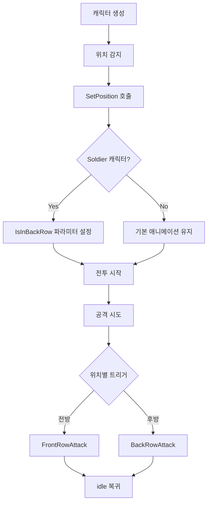

# Soldier 캐릭터 위치별 애니메이션 시스템 개발 로그

## 📅 개발 일자: 2025년 8월 17일

## 🎯 프로젝트 목표
Soldier 캐릭터가 전방과 후방 배치에서 서로 다른 애니메이션을 실행하도록 구현

## 🔍 개발 배경
- Soldier 캐릭터는 레벨 3에서 후방 배치가 해금됨
- 전방에서는 근접 전투, 후방에서는 원거리 지원 역할을 구분하기 위함
- 게임플레이의 전략적 깊이와 시각적 다양성 증대

## 🏗️ 시스템 아키텍처

### 1. 데이터 구조 확장
#### CharacterData.cs 수정
```csharp
// 위치 해금 시스템 추가
[Serializable]
public struct PositionUnlock
{
    public int requiredLevel;
    public PositionType unlockedPosition;
    [Tooltip("위치 해금과 함께 표시할 메시지")]
    public string unlockMessage;
}

public List<PositionUnlock> positionUnlocks = new List<PositionUnlock>();
```

#### PositionType 열거형
```csharp
public enum PositionType
{
    Front,  // 전방
    Back    // 후방
}
```

### 2. 핵심 로직 구현
#### PlayerCharacter.cs 주요 추가 기능

##### 위치 감지 시스템
```csharp
private PositionType currentPosition = PositionType.Front;

/// <summary>현재 위치를 감지하고 애니메이션 상태를 설정</summary>
private void DetectAndSetPosition()
{
    // X 좌표를 기준으로 전방/후방 판단 (0에 가까우면 전방, 음수면 후방)
    float xPosition = transform.localPosition.x;
    PositionType detectedPosition = Mathf.Abs(xPosition) < 0.1f ? PositionType.Front : PositionType.Back;
    SetPosition(detectedPosition);
}
```

##### 위치별 애니메이션 설정
```csharp
/// <summary>캐릭터 위치를 설정하고 해당 애니메이션 상태를 적용</summary>
public void SetPosition(PositionType position)
{
    currentPosition = position;
    
    // Soldier 캐릭터만 위치별 애니메이션 적용 (공격만, idle은 공용)
    if (data != null && data.displayName == "Soldier" && animator != null)
    {
        // 애니메이터 파라미터 설정 (공격 분기용)
        if (HasAnimatorParameter("IsInBackRow"))
        {
            bool isBackRow = (position == PositionType.Back);
            animator.SetBool("IsInBackRow", isBackRow);
        }
    }
}
```

##### 위치별 공격 애니메이션 분기
```csharp
protected override void TryAttack()
{
    // ... 기존 타겟팅 로직 ...
    
    // Soldier 캐릭터의 위치별 공격 애니메이션
    if (data != null && data.displayName == "Soldier")
    {
        string attackTrigger = currentPosition == PositionType.Back ? "BackRowAttack" : "FrontRowAttack";
        
        if (HasAnimatorParameter(attackTrigger))
        {
            animator.SetTrigger(attackTrigger);
        }
        else
        {
            // 폴백: 기본 Attack 트리거 사용
            animator.SetTrigger("Attack");
        }
    }
    else
    {
        // 다른 캐릭터는 기본 Attack 트리거 사용
        animator.SetTrigger("Attack");
    }
}
```

### 3. UI 시스템 통합
#### GameUIManager.cs 확장

##### 동적 위치 검증
```csharp
/// <summary>캐릭터가 해당 위치에 배치 가능한지 확인 (기본 위치 + 스킬 해금 위치)</summary>
private bool IsCharacterAllowedInPosition(CharacterData character, PositionType targetPosition)
{
    // 기본 위치 확인
    if (character.position == targetPosition)
        return true;
    
    // 스킬 해금 위치 확인
    if (character.positionUnlocks != null)
    {
        int currentLevel = GetCharacterLevel(character);
        foreach (var positionUnlock in character.positionUnlocks)
        {
            if (positionUnlock.unlockedPosition == targetPosition && currentLevel >= positionUnlock.requiredLevel)
                return true;
        }
    }
    
    return false;
}
```

##### 위치 해금 알림 시스템
```csharp
/// <summary>위치 해금 팝업 표시</summary>
private void ShowPositionUnlockPopup(CharacterData character, PositionUnlock positionUnlock)
{
    // 스킬 해금 팝업 UI를 재사용하여 위치 해금 알림 표시
    string positionName = positionUnlock.unlockedPosition == PositionType.Front ? "전방" : "후방";
    string message = string.IsNullOrEmpty(positionUnlock.unlockMessage) 
        ? $"레벨 {positionUnlock.requiredLevel} 달성으로 {positionName} 배치가 해금되었습니다!"
        : positionUnlock.unlockMessage;
    
    // UI 설정 및 팝업 표시
}
```

### 4. BattleManager 연동
#### 캐릭터 생성 시 위치 설정
```csharp
// 캐릭터 생성 후 위치 명시적 설정
var pc = go.AddComponent<PlayerCharacter>();
pc.Setup(characterData, level);

// 위치 설정 (애니메이션 상태 적용)
PositionType position = isFrontRow ? PositionType.Front : PositionType.Back;
pc.SetPosition(position);
```

## 🛠️ 개발 도구

### 1. 에디터 스크립트: CharacterDataEditor.cs
```csharp
[MenuItem("Tools/Character Data/Setup Soldier Position Unlock")]
public static void SetupSoldierPositionUnlock()
{
    // Soldier 캐릭터에 후방 배치 해금 자동 설정
    // 레벨 3에서 후방 배치 해금
    // 커스텀 해금 메시지 지원
}
```

### 2. 애니메이션 설정 도구: SoldierAnimationSetup.cs
```csharp
[MenuItem("Tools/Animation/Setup Soldier Position Animations")]
public static void ShowWindow()
{
    // 애니메이터 파라미터 자동 추가
    // 필요한 상태 및 트랜지션 가이드 제공
}
```

## 🎮 애니메이션 구조

### 필요한 애니메이터 파라미터
- `IsInBackRow` (Bool) - 후방 배치 여부
- `FrontRowAttack` (Trigger) - 전방 공격 트리거
- `BackRowAttack` (Trigger) - 후방 공격 트리거

### 애니메이션 상태 구조
```
idle (공용)
├── FrontRowAttack (전방 근접 공격)
│   └── → idle
└── BackRowAttack (후방 원거리 공격)
    └── → idle
```

### 트랜지션 조건
1. `idle → FrontRowAttack`: `FrontRowAttack` Trigger + `IsInBackRow` = false
2. `idle → BackRowAttack`: `BackRowAttack` Trigger + `IsInBackRow` = true
3. 공격 상태들 → `idle`: 애니메이션 종료 시 자동 복귀

## 📊 시스템 특징

### ✅ 장점
1. **모듈화**: Soldier 캐릭터만 특별 처리, 다른 캐릭터는 기존 시스템 유지
2. **확장성**: 다른 캐릭터에도 쉽게 적용 가능한 구조
3. **안전성**: 폴백 시스템으로 애니메이션 누락 시에도 안정적 동작
4. **효율성**: idle 애니메이션은 공용 사용으로 리소스 절약

### 🔄 동작 흐름


## 🐛 디버깅 정보

### 로그 메시지 예시
```
[Soldier(Clone)] 위치 감지: X=-2.00, Position=Back
[Soldier(Clone)] Soldier 위치 애니메이션 설정: IsInBackRow=True
[Soldier(Clone)] Soldier 위치별 공격: BackRowAttack
```

### 문제 해결 체크리스트
1. **애니메이터 파라미터 존재 여부**: `HasAnimatorParameter()` 메서드로 확인
2. **위치 감지 정확성**: X 좌표 기반 전방/후방 판단 로직
3. **트랜지션 조건**: Animator Controller에서 조건 설정 확인
4. **폴백 동작**: 위치별 애니메이션 없을 때 기본 Attack 트리거 사용

## 🔧 설정 가이드

### Unity 에디터 설정 순서
1. **Tools > Character Data > Setup Soldier Position Unlock** 실행
2. **Tools > Animation > Setup Soldier Position Animations** 실행
3. Soldier Animator Controller에서 상태 및 트랜지션 수동 설정
4. 애니메이션 클립 할당 및 테스트

### 필수 설정 사항
- Soldier.asset에 레벨 3 후방 배치 해금 설정
- Soldier_new.controller에 필요한 파라미터 및 상태 추가
- 각 공격 상태에 적절한 애니메이션 클립 할당

## 🚀 향후 확장 계획

### 가능한 개선 사항
1. **더 많은 캐릭터 지원**: 다른 직업별 위치 특화 애니메이션
2. **상태별 효과**: 위치에 따른 공격력/방어력 보정
3. **시각적 효과**: 위치별 다른 이펙트 시스템
4. **AI 전술**: 적 AI의 위치 기반 행동 패턴

### 확장 시 고려사항
- CharacterData에 `supportsPositionAnimations` 플래그 추가 검토
- 애니메이션 상태 관리의 복잡도 증가에 대한 대응
- 성능 최적화 및 메모리 관리

## 📝 개발 완료 상태

### ✅ 완료된 기능
- [x] 동적 위치 해금 시스템
- [x] 위치별 애니메이션 분기 로직
- [x] UI 통합 및 알림 시스템
- [x] 에디터 도구 및 자동화 스크립트
- [x] 디버깅 및 로깅 시스템

### 🔄 진행 중
- [ ] Unity Animator Controller 수동 설정
- [ ] 애니메이션 클립 제작 및 할당
- [ ] 최종 테스트 및 밸런싱

### 📋 검증 필요
- [ ] 모든 시나리오에서 애니메이션 정상 동작 확인
- [ ] 성능 영향도 측정
- [ ] 사용자 경험 테스트

---

**개발자 노트**: 이 시스템은 Pixel-Clash의 전략적 깊이를 높이는 중요한 기능입니다. 모듈화된 설계로 향후 다른 캐릭터로의 확장이 용이하며, 안정성과 확장성을 모두 고려한 구조로 개발되었습니다.
